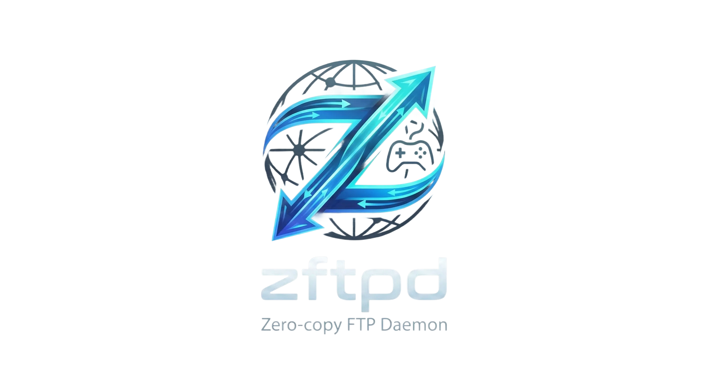

<div align="center">



<br/><br/>

**A zero-copy FTP daemon built for speed, correctness, and portability.**  
Runs anywhere POSIX runs. Saturates Gigabit. Ships a console payload too.

<br/>

[](https://en.cppreference.com/w/c/11)
[](LICENSE)
[](https://github.com/seregonwar/zftpd/releases)
[](#build)

<br/>

[Overview](#overview) · [Performance](#-performance) · [Features](#-features) · [Best Setup](#-best-setup) · [Build](#-build) · [Running](#-running) · [Configuration](#-configuration) · [ZHTTP](#-zhttp)

<br/>

</div>

---

## Overview

`zftpd` is a high-performance FTP server written in C11. It was designed around a single idea: **the data path should be as fast as the hardware allows**, with no unnecessary work anywhere between file and socket.

In practice, this means using `sendfile` where the OS supports it, keeping the hot path free of allocations, and handling TCP backpressure correctly so the pipe never stalls under load. The result is an FTP daemon that **saturates a full Gigabit Ethernet link** in both directions — on Linux, macOS, or any POSIX-compliant system — without any client-side tuning.

The same binary model also targets PS4 and PS5 as console payloads, with on-screen notifications and an optional browser-based file explorer. This is an extension of the same codebase, not a fork — the POSIX foundation is identical.

```
Philosophy
  ├── Keep the data path fast          →  sendfile fast path, zero-copy where available
  ├── Handle TCP correctly             →  partial sends, EINTR, backpressure-aware buffers
  ├── Stay portable                    →  C11, POSIX, standard toolchain
  ├── Be predictable under load        →  no dynamic allocation per transfer, no surprises
  └── Extras are opt-in               →  encryption, rate limiting, web UI — all compile-time
```

---

## ⚡ Performance

> `zftpd` saturates a full Gigabit Ethernet link — **~112 MB/s sustained** in both directions.

This is the physical ceiling of a 1 GbE connection. It is achieved out of the box, with no kernel tuning required.

```
  Benchmark — single stream, wired 1 GbE, plain transfer

  Download  ████████████████████████████████████████████  112 MB/s
  Upload    █████████████████████████████████████████     108 MB/s
                                                          ────────
  Physical ceiling (1 GbE)                                125 MB/s
```

**What makes it fast:**

| Technique | What it does |
|---|---|
| `sendfile` kernel fast path | Moves file data directly to the socket — zero userspace copies |
| Partial-send loop | Handles short writes without stalling or corrupting the stream |
| EINTR-safe I/O | Signal interrupts are absorbed cleanly in the hot loop |
| Allocation-free transfer path | No `malloc`, no locking per packet or per transfer |
| Token-bucket limiter is opt-in | Adds zero overhead when rate limiting is not needed |

> **On encryption:** enabling `AUTH XCRYPT` (ChaCha20) disables `sendfile` and switches to buffered I/O. Throughput becomes CPU-bound. For maximum speed on a trusted network, use plain transfers — that is what `sendfile` is there for.

---

## ✦ Features

<table>
<tr>
<td width="50%" valign="top">

**Transfer engine**
- `sendfile` zero-copy fast path (Linux · BSD · macOS)
- Fallback to buffered I/O when encrypted
- Backpressure-aware send loop, EINTR-safe
- Upload resume: `REST` + `STOR`
- Append mode: `APPE`
- Transfer rate limiting via token bucket *(compile-time, opt-in)*

**Connection handling**
- Active mode: `PORT`
- Passive mode: `PASV`, `EPSV`
- Control and data channel timeouts
- Session idle timeout
- Up to `FTP_MAX_SESSIONS` concurrent sessions

</td>
<td width="50%" valign="top">

**Security**
- Path canonicalization — no traversal possible
- Optional blocklist for `/dev`, `/proc`, `/sys`
- Optional ChaCha20 stream cipher with PSK (`AUTH XCRYPT`)

**Observability**
- Structured per-session logging
- Transfer stats: bytes sent/received, files transferred
- Per-command logging *(compile-time toggle)*

**Platform extras**
- Linux, macOS, PS4, PS5
- On-screen IP/port notification on PS4 and PS5
- ZHTTP web file explorer *(compile-time, see [ZHTTP](#-zhttp))*

</td>
</tr>
</table>

<details>
<summary><b>Complete FTP command reference</b></summary>

<br/>

| Group | Commands |
|---|---|
| Authentication | `USER` `PASS` `QUIT` `NOOP` |
| Navigation | `CWD` `CDUP` `PWD` |
| Directory listing | `LIST` `NLST` `MLSD` `MLST` |
| File transfer | `RETR` `STOR` `APPE` `REST` |
| File management | `DELE` `RMD` `MKD` `RNFR` `RNTO` |
| Data connection | `PORT` `PASV` `EPSV` |
| Metadata | `SIZE` `MDTM` `STAT` `SYST` `FEAT` `HELP` |
| Transfer parameters | `TYPE` `MODE` `STRU` |
| Negotiation | `OPTS` `CLNT` |
| Site extensions | `SITE CHMOD` |
| Encryption | `AUTH XCRYPT` — ChaCha20 with PSK *(opt-in)* |

</details>

---

## 🛠 Best Setup

### Network — wired is the only choice

`zftpd` performs at the physical limit of your network. The bottleneck is almost always the medium, not the software. **Wi-Fi is the bottleneck** — even Wi-Fi 6 introduces retransmissions and variable latency that collapse sustained FTP throughput. Use a wired connection.

The optimal topology is a direct Ethernet cable between source and destination, eliminating every unnecessary hop:

```
  [Source machine]
        │
  Ethernet cable
        │
  [Destination machine]
```

If a switch is needed, any Gigabit switch works. Avoid powerline adapters and MoCA bridges — they introduce jitter that disrupts sustained transfers.

**Assign static IPs on both ends** (e.g. `192.168.100.1` / `192.168.100.2`). This removes DHCP latency and keeps the setup fully deterministic.

---

### FTP clients

| Client | Platform | Recommendation |
|---|---|---|
| **FileZilla** | Windows · macOS · Linux | Best general-purpose choice. Enable parallel transfers for directory trees. |
| **WinSCP** | Windows | Excellent throughput and error recovery. |
| **lftp** | Linux · macOS | Best CLI option. `pget -n 4` enables parallel chunked downloads. |
| **Cyberduck** | macOS · Windows | Solid for occasional transfers. |
| OS built-in FTP | any | ❌ Avoid — artificially capped speeds, no resume support. |

**Things that matter on the client side:**

- **Transfer mode must be Binary** (`TYPE I`). `zftpd` defaults to Binary, but a misconfigured client can override this silently — always verify.
- **Use passive mode** (`PASV`). It's the default and works cleanly behind NAT and firewalls. Active mode requires the server to reach back to the client and is frequently blocked.
- **Enable parallel connections** for large directory trees. FileZilla exposes this under Site Manager → Transfer Settings. It will not increase single-file speed, but dramatically reduces total time for many small files.
- **Disable client-side CRC or integrity checks** if offered. TCP guarantees delivery; checksumming again adds latency for no benefit.

---

### Linux — optional kernel tuning

`zftpd` reaches full Gigabit speed with default kernel parameters. If you are feeding a very fast NVMe drive into the network and want to raise the ceiling further:

```bash
# Raise socket buffer limits — run as root, optional
sysctl -w net.core.rmem_max=134217728
sysctl -w net.core.wmem_max=134217728
sysctl -w net.ipv4.tcp_rmem="4096 87380 134217728"
sysctl -w net.ipv4.tcp_wmem="4096 65536 134217728"
```

To make these persistent, add them to `/etc/sysctl.conf`.

<details>
<summary><b>PS4 / PS5 — console-specific notes</b></summary>

<br/>

- `zftpd` requires a payload loader to run on console (WebKit / PPPwn / GoldHEN on PS4; etaHEN or equivalent on PS5). The daemon itself does not require a resident HEN.
- Launch after the system is fully booted and the loader is ready. The on-screen notification will display the IP and port.
- For maximum throughput: direct cable from console to PC, static IPs, no router in between.
- Avoid initiating transfers while background downloads or system updates are active — the network stack is shared.
- If you see **"payload already loaded"**: a previous instance is still active. `zftpd` will attempt to terminate it and restart on the default port. If that fails, it tries up to 9 subsequent ports (`FTP_DEFAULT_PORT+1` … `+9`).

</details>

---

## 📦 Build

Output artifacts are versioned and platform-tagged, placed in `build/<target>/<build_type>/`.

### Requirements

| | |
|---|---|
| Compiler | C11 — `gcc` or `clang` |
| Build system | `make` |
| `.bin` generation | `objcopy` (binutils or llvm-objcopy); PS4: `orbis-objcopy`; PS5: `prospero-objcopy` |
| PS4 | `PS4_PAYLOAD_SDK` set in environment |
| PS5 | `PS5_PAYLOAD_SDK` set in environment |

### Commands

```bash
# Targets
make TARGET=linux
make TARGET=macos
make TARGET=ps4
make TARGET=ps5

# Modifiers
make TARGET=linux BUILD_TYPE=debug
make TARGET=linux ENABLE_ZHTTPD=1     # enable web UI (off by default on POSIX)
make TARGET=ps5   ENABLE_ZHTTPD=0     # disable web UI (on by default on console)

# Tests (POSIX only)
make TARGET=linux test
make TARGET=macos test
```

### Artifacts

| Platform | Output |
|---|---|
| Linux | `build/linux/release/zftpd-linux-<arch>-v<ver>.elf` |
| macOS | `build/macos/release/zftpd-macos-<arch>-v<ver>` |
| PS4 | `zftpd-ps4-v<ver>.bin` · `zftpd-ps4-v<ver>.elf` |
| PS5 | `zftpd-ps5-v<ver>.bin` · `zftpd-ps5-v<ver>.elf` |

---

## 🚀 Running

### Linux

```bash
./build/linux/release/zftpd-linux-<arch>-v<version>.elf [-p <port>] [-d <root>]
```

### macOS

```bash
./build/macos/release/zftpd-macos-<arch>-v<version> [-p <port>] [-d <root>]
```

### PS4

Send `.bin` to your payload loader, or `.elf` if the loader accepts ELF directly.  
On startup: on-screen notification displays IP and port.

### PS5

Send `.bin` or `.elf` depending on your loader.  
On startup: `FTP: <ip>:<port>` notification.

---

## ⚙️ Configuration

All configuration is compile-time, in [`include/ftp_config.h`](include/ftp_config.h).

| Macro | Default | Notes |
|---|---|---|
| `FTP_DEFAULT_PORT` | `2121` (POSIX) · `2122` (console) | Listening port |
| `FTP_MAX_SESSIONS` | — | Maximum concurrent client sessions |
| `FTP_SESSION_TIMEOUT` | — | Idle session timeout |
| `FTP_TRANSFER_RATE_LIMIT_BPS` | *disabled* | Token-bucket average rate cap |
| `FTP_TRANSFER_RATE_BURST_BYTES` | *disabled* | Token-bucket burst allowance |
| `FTP_LOG_COMMANDS` | — | Log every received command |

---

## 🌐 ZHTTP

ZHTTP is a lightweight HTTP server embedded in `zftpd` that serves a browser-based file explorer. It allows browsing, downloading, and optionally uploading files from any browser on the local network — no FTP client required.

| Target | Default | To override |
|---|---|---|
| PS4 / PS5 | ✅ on | `make TARGET=ps5 ENABLE_ZHTTPD=0` |
| Linux / macOS | ❌ off | `make TARGET=linux ENABLE_ZHTTPD=1` |

Once the daemon is running, open `http://<ip>:<port>/` — the HTTP port mirrors the configured FTP port.

Upload support is enabled automatically alongside ZHTTP (`ENABLE_WEB_UPLOAD=1`).

> **Security:** ZHTTP has no authentication beyond network access. It is designed for local-network use. Do not expose it on a public interface.

---

## Acknowledgements

**hippie68** — PS4 FTP reference implementation  
**John Törnblom** — PS5 payload framework  
**PlayStation homebrew community** — testing and feedback

---

<div align="center">

Released under the [MIT License](LICENSE)

</div>
